# CS440 Online Fall 2026, MP 3: Robot Motion Planning
## Due: Sunday, October 4, 2026, 11:59 PM CST

## I. Overview

In this assignment you will implement simplified versions of several core motion-planning algorithms. The robot is a planar rectangle that translates and rotates in a 2D workspace with polygonal obstacles. You will implement configuration-space collision checking, a Dubins-car style `AbstractState`, kinodynamic RRT, one-shot PRM, and a PRM-based heuristic for the Dubins-car. As in MP1 and MP2, a large part of the assignment is understanding the provided code and how the different components interact.

## II. Getting Started

To get started, look inside the `template/` directory. The template contains:

* `cspace.py`. You will edit and submit this. It defines configuration-space helpers and the rectangular robot collision checker
* `robot.py`. You will edit and submit this. It defines the unicycle dynamics and `DubinsCarState`
* `rrt.py`. You will edit and submit this. It defines kinodynamic RRT
* `prm.py`. You will edit and submit this. It defines one-shot PRM and a PRM-based heuristic
* `search.py`. You will edit locally but not submit. Copy your MP1/MP2 `best_first_search` and `backtrack` here
* `state.py`. You will edit locally but not submit. Copy your MP1/MP2 `AbstractState.__lt__` implementation here
* `main.py`. Local entrypoint for running planners and visualizations
* `requirements.txt`. Install dependencies from inside `template/` with `pip install -r requirements.txt`. The main new package is `shapely` for polygonal collision checking
* `data/`. JSON files containing workspace and robot parameters

Please ONLY submit `cspace.py`, `robot.py`, `rrt.py`, and `prm.py`.

This is the first assignment where we will start to use NumPy heavily. When working with batches of points, prefer array operations over loops. In particular, `point_in_boundary` and `sample_n_configs_in_boundary` must operate on complete arrays rather than looping or using comprehensions.

For all random choices in this assignment, use NumPy's module-level `np.random` functions. The provided `--seed` option seeds this generator so that RRT and PRM runs are reproducible.

## III. CSpace

There are 5 `TODO(III)` blocks in `cspace.py`.

You will implement a 3D configuration space for a rectangular robot in a 2D workspace:

1. `point_in_boundary(x, boundary)`: check whether an arbitrary-dimensional point is inside an arbitrary-dimensional boundary. The boundary has shape `(n, 2)`, and points exactly on the boundary count as inside
    * This method must work for any number of dimensions, not just 2D
    * You do not need a loop or comprehension over dimensions; you can use NumPy broadcasting and array operations like `np.all` to check all dimensions at once
2. `sample_n_configs_in_boundary`: sample uniformly within the CSpace boundary
    * You should sample the whole batch at once using NumPy rather than looping over configurations
3. `forward_kinematics`: compute the four rectangle corners from `(x, y, theta)`
    * Many valid implementations but a simple one is to...
        * Start with a rectangle centered at the origin
        * Rotate it by `theta` *counterclockwise*
        * Then translate by `(x, y)`
4. `is_valid`: check CSpace boundary, workspace boundary, and obstacle collisions
    * Here you will use the `shapely` library, you may need to read through some documentation
    * The robot is a rectangle (four corners returned by `forward_kinematics`)
    * The obstacles are polygons (sequence of vertices)
    * You should:
        * first check whether the configuration itself is in the CSpace boundary, 
        * then check whether the rectangle is inside the workspace boundary, 
        * and finally check whether the rectangle intersects any obstacles
5. `straight_line_local_planner`: interpolate between configurations for edge checking, returning a list of intermediate configurations
    * The step size between consecutive configs should be `self.interpolation_delta`
    * Don't return the start and end configs, only the intermediate configs
    * `is_valid_edge` checks only these intermediate configurations. Its callers are responsible for ensuring the start and end configurations themselves are valid
    * If there are no intermediates, i.e., if the start and end configs are closer than `self.interpolation_delta`, return an empty list or empty array
    * Angles wrap around. The shortest direction from `theta=0.1` to `theta=2*pi-0.1` goes through `0`, not all the way around the circle. This has many implications for distance computation, and thus interpolation and nearest-neighbor queries. Moreover whenever you find yourself computing new angles from old ones (e.g., `theta_new = theta_old + delta_theta`), you should wrap the result to `[0, 2*pi)` using the modulo operation `theta % (2 * np.pi)`
    * Use the provided `cspace.point_to_point_direction(...)` and `cspace.point_to_point_distance(...)` functions when interpolating or comparing configurations with angular dimensions to ensure proper distance calculations, but in some places you will need to implement custom logic

Run local CSpace sanity checks:

```
python3 cspace.py
```

The file currently uses `data/clutter.json`. You can edit that path in the `if __name__ == "__main__"` block. These local checks are not exhaustive so you should definitely consider adding more checks there as you debug (e.g., your interpolation logic).

## IV. Copy Code from MP1/MP2

There are 2 `TODO(IV)` blocks, one in `search.py` and one in `state.py`.

Copy over your `best_first_search`, `backtrack`, and `AbstractState.__lt__` implementations from MP1/MP2 in preparation for the next part. Note that this is purely for your own testing, the autograder uses its own staff copy of search/state and you will not submit these files.

## V. Robot and DubinsCarState

<figure align="center">
    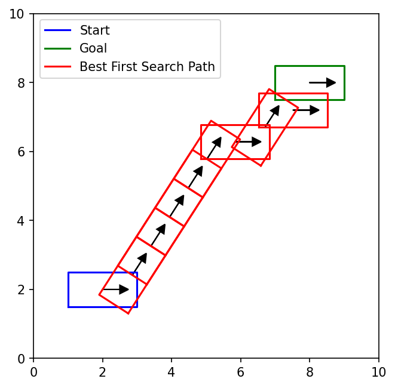
    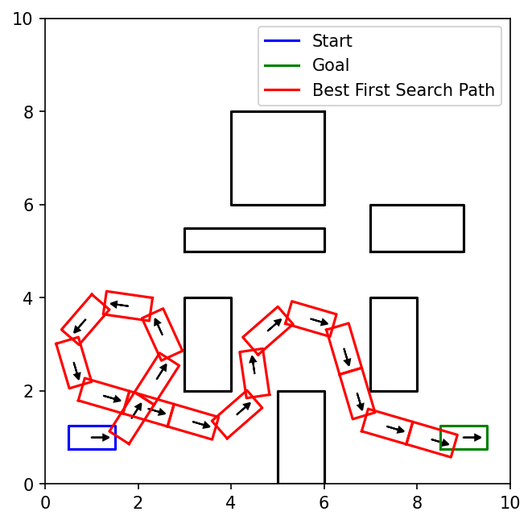
    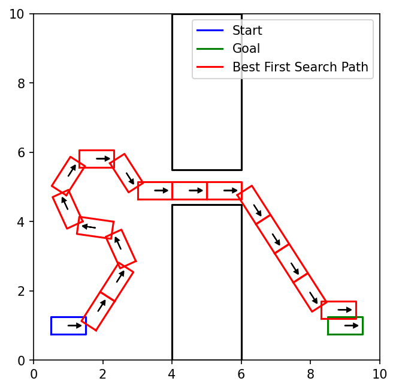
    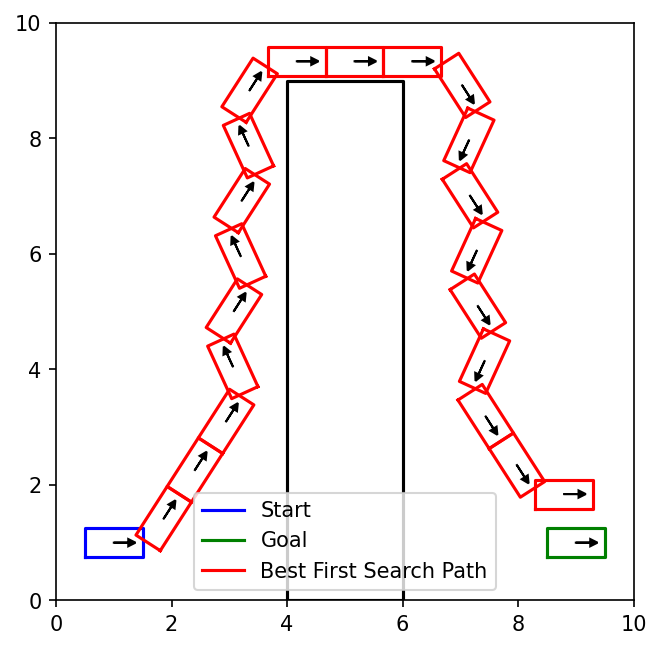
    <figcaption align="center"><b>Best first search on a Dubins car in four environments.</b></figcaption>
</figure>

There are 4 `TODO(V)` blocks in `robot.py`.

You will implement:

1. `UnicycleRobot.dynamics`: apply one control for a time step
    * A configuration is `(x, y, theta)`
    * A control is $(v, \dot\theta)=$`(velocity, turn_rate)`
    * The unicycle dynamics are:
      $$ \dot{x} = v \cdot \cos(\theta) $$
      $$ \dot{y} = v \cdot \sin(\theta) $$
    * The next state is computed by integrating the dynamics over a time step `dt`:
      $$ x_{next} = x + \dot{x} \cdot dt $$
      $$ y_{next} = y + \dot{y} \cdot dt $$
      $$ \theta_{next} = \theta + \dot{\theta} \cdot dt $$
    * After updating `theta`, wrap it back into `[0, 2*pi)` using `theta % (2 * np.pi)`!
2. `Robot.apply_constant_control`: repeatedly apply a control and return all intermediate configurations
    * Use `self.dynamics` to compute the next configuration at each time step
    * The time step is `self.interpolation_delta`, and you should apply the control for a total of `t` time
    * If `t` is not divisible by `self.interpolation_delta`, the final time step will be shorter so that the simulation ends exactly at time `t`
    * If `t` is divisible by `self.interpolation_delta`, be careful about adding an extra near-zero time step because of floating-point roundoff
3. `DubinsCarState.get_neighbors`: generate left, straight, and right Dubins-car neighbors while rejecting actions that lead to invalid intermediate configurations
    * When creating a neighboring state, pass along the same `goal`, `use_heuristic`, `car_params`, and `heuristic_func`. Increase `dist_from_start` by `control_duration * velocity`
4. `DubinsCarState.is_goal`: check whether the current configuration is within or exactly on the goal tolerance using `cspace.point_to_point_distance`

Run best-first search with the default Euclidean heuristic:

```
python3 main.py --search_type=best_first_search --params_file=data/open.json
```

You can replace `data/open.json` with `data/clutter.json`, `data/narrow_passage.json`, or `data/harder_passage.json`. To save the visualization instead of opening a window, add `--save_image=best_first_search_open_result.png --no_show`.

## VI. RRT

<figure align="center">
    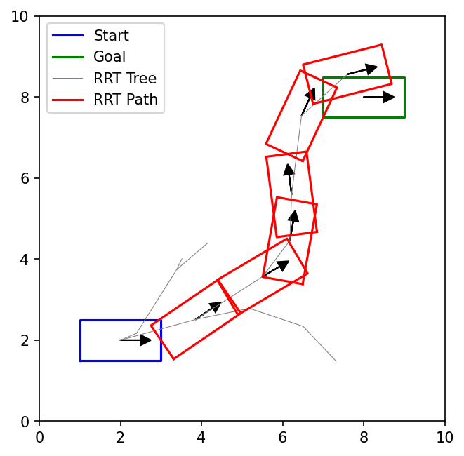
    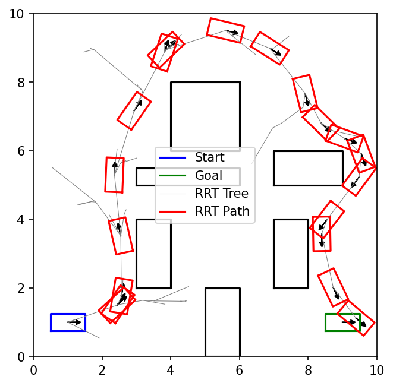
    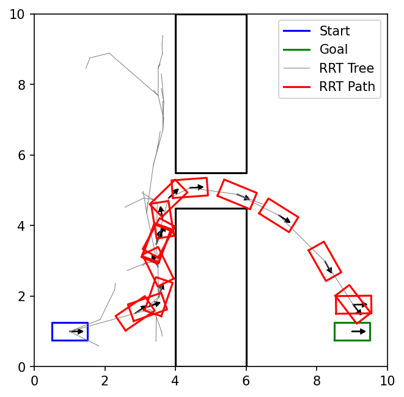
    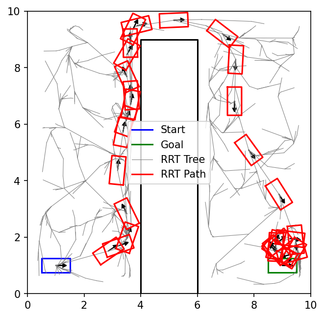
    <figcaption align="center"><b>Example KinodynamicRRT runs. RRT is stochastic, so exact trees can differ between runs.</b></figcaption>
</figure>

We now move on from best-first search to kinodynamic RRT. We provide you with a basic high level algorithm for a guided tree search, namely one which iteratively calls `select_node` and `expand_node` methods to build the tree. We represent the tree as a list of numpy configs along with with a dictionary that maps indices in this array to their parents (and saving the action that was taken from the parent). We then instantiate a child of this class called `KinodynamicRRT` which specifically implements these two methods using random sampling and extension towards the random sample. Your job is to implement the `select_node` and `expand_node` methods in `rrt.py`.

For `select_node`, choose the goal with probability `goal_sample_prob`; otherwise call `cspace.sample_n_configs_in_boundary(1)` once. Then *select* the tree node nearest to that sample. For `expand_node`, call `robot.sample_random_controls(num_control_samples)` once, simulate each returned control from the selected node, reject invalid trajectories, and *return the valid endpoint closest to the sampled configuration*. Do not draw replacement configurations or controls after validation. Whenever doing nearest neighbor computations you should use the provided `cspace.point_to_point_distance(...)` function to ensure proper distance calculations for angular dimensions. Notice that the generic `expand_node` method in `GuidedTreeSearch` is expected to return a *list* of possible new nodes but our implementation will return at most a single expansion, so you will need to wrap the single new node in a list, i.e., your return type should look like `[(new_config, control_from_parent)]`.

Run RRT:

```
python3 main.py --search_type=rrt --params_file=data/open.json --max_iterations=3000 --num_neighbors=10 --rrt_control_duration=1.0 --rrt_goal_sample_prob=0.1
```

You can replace the data file or tune the RRT parameters. Add `--seed=0` for a reproducible local run.

## VII. PRM

<figure align="center">
    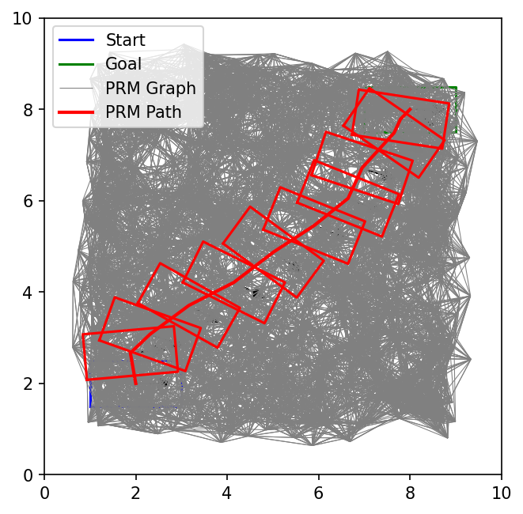
    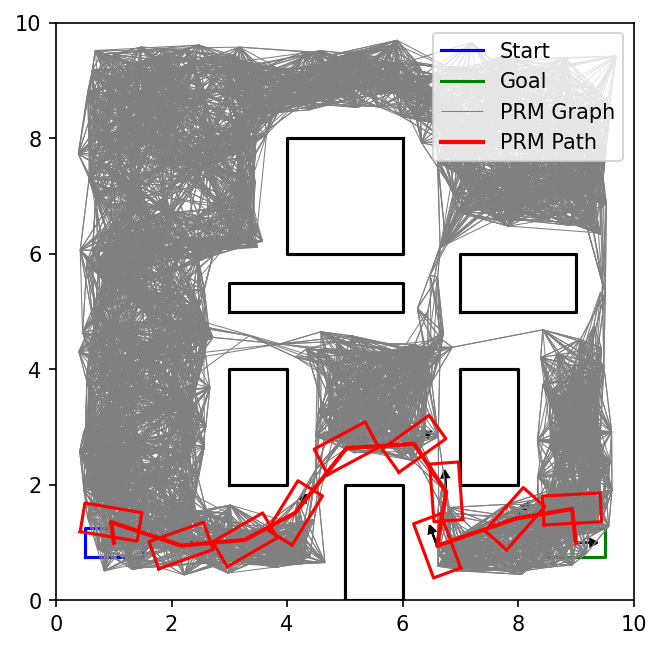
    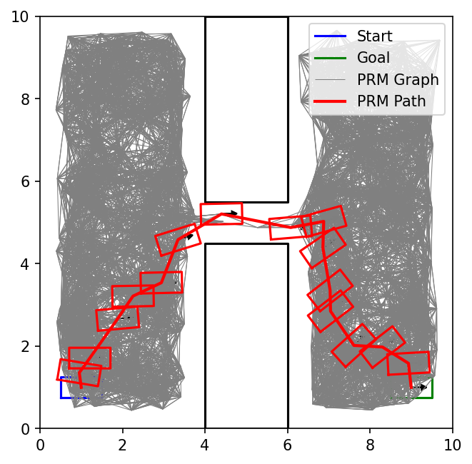
    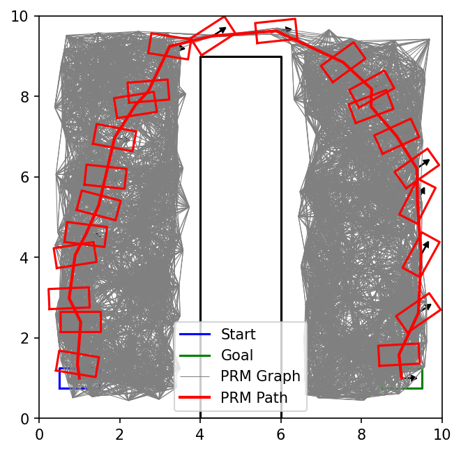
    <figcaption align="center"><b>Example one-shot PRM runs - our implementation is "one-shot" in the sense that we sample and validate one time rather than iteratively building the graph until a path exists. In other words, we are preprocessing the CSpace for many possible queries rather than solving a single specific one. Notice that PRM does not work for Kinodynamic constraints and so these paths are for a rectangular robot that can translate and rotate in the plane - a less constrained problem.</b></figcaption>
</figure>

There is 1 `TODO(VII)` in `prm.py`.

`OneShotPRM.__init__` should:

1. draw exactly `num_samples` candidate configurations in one batch
    * sample uniformly at random in the cspace boundary
2. validate that one batch and keep only its valid configurations as `self.vertices`
    * the resulting roadmap may have any number of vertices from zero through `num_samples`
    * do not draw replacement samples for invalid configurations
3. for each vertex, identify the nearest `min(num_neighbors, len(self.vertices) - 1)` other vertices as its candidate neighbors
    * as always, use `cspace.point_to_point_distance(...)` for nearest neighbor computations to ensure proper distance calculations for angular dimensions
    * validate each candidate edge once and do not consider farther vertices when a candidate edge is invalid
4. save each valid candidate as a directed edge and store its CSpace distance as the edge length in `self.edges`

The sample and candidate sets above are fixed before validation. Keeping replacements until you get `num_samples` valid vertices, or checking farther neighbors until you find `num_neighbors` valid edges, changes the required algorithm and breaks the local efficiency that PRM is built on. For example, a vertex surrounded by obstacles could otherwise require checking every other vertex in the graph.

You may also be tempted to add a *reverse edge* whenever you validate the edge from vertex A to vertex B. This also creates a subtle bug - our edge validator *is not symmetric*! Interpolating in increments of `self.interpolation_delta` from A to B is not the same as interpolating from B to A, and one direction may return valid while the other is not, *even if in continuous space these are symmetric*. In a different implementation you might ensure your edge validator is symmetric (say by checking both directions or ensuring symmetric interpolation), but for this assignment our PRM is a directed non-symmetric graph.

Example graph format:

```python
# stores the vertices as configurations in a numpy array of shape (num_valid_vertices, 3)
self.vertices = np.array([
    [1.0, 1.0, 0.0],
    [2.0, 1.0, 0.2],
    [4.0, 2.0, 6.1],
])
# stores outgoing edges from each vertex as index, cost/distance
self.edges = {
    0: [(1, 1.02), (2, 3.15)],
    1: [(0, 1.02)],
    2: [], # note that 0 might not show up as a neighbor of 2 even though 2 is a neighbor of 0
}
```

Run PRM:

```
python3 main.py --search_type=prm --params_file=data/open.json --max_iterations=2000 --num_neighbors=20
```

As usual, you can replace the data file or tune the PRM parameters. Add `--seed=0` for a reproducible local run.

## VIII. Best First Search with PRM Heuristic

There is 1 `TODO(VIII)` in `prm.py`.

The PRM path is not dynamically feasible for the Dubins car, but it can still give useful geometric guidance. You will now build a PRM for a 2D point-robot projection of the original CSpace, then use the returned PRM path length as a heuristic for `DubinsCarState`.

Specifically, create a `PolygonalCSpace` whose configurations are just 2-dimensional `(x, y)`, using the same workspace boundary and obstacles as the original CSpace. Remember that points on an obstacle boundary count as colliding. The `cspace_boundary` should be the same as the `workspace_boundary` and the projection should use the center of the rectangle as the 2D configuration (i.e., `config[:2]`). Its `forward_kinematics` should return one workspace point, represented as `[config[:2]]` or an array of shape `(1, 2)`. Then create a `OneShotPRM` on that 2D CSpace. The returned heuristic function should query that PRM using the projection of the config and projection of the goal (i.e., `config[:2]` and `goal_config[:2]`). If the PRM query fails, fall back to the original CSpace straight-line distance.

To make the above work you may want to create a new child of the `PolygonalCSpace` class to work for such point robots or even modify the original implementation to be more general...

Run best-first search with the PRM heuristic:

```
python3 main.py --search_type=best_first_search --heuristic_type=PRM2D --params_file=data/harder_passage.json --max_iterations=1000 --num_neighbors=20
```

The PRM heuristic is intended to provide more useful guidance than straight-line distance, especially on `harder_passage`, though wall-clock time may not improve because building and querying the roadmap has overhead. As usual, you can replace the data file or tune the PRM parameters. Add `--seed=0` for a reproducible local run.

## Submission Instructions

Submit the main part of this assignment by uploading `cspace.py`, `robot.py`, `rrt.py`, and `prm.py` to Gradescope. Do not forget to access Gradescope from the Launch App button in Coursera so that your grade is automatically sync'd.

Before submitting, make sure to comment out any print statements you added for debugging, since extra output can slow down your code on the autograder.

## Policies

You are expected to be familiar with the general policies on the course syllabus, including academic integrity. In particular, this is an individual assignment and you may not use external sources to write significant parts of your code for you.
